# no-cap.ai

**AI Video Captioning Pipeline — Scene Detection, CLIP Keyframes & Multi-Style Vision-Language Captioning**

*Built for AMD Developer Hackathon: ACT II*


<!--  -->

---

## Features

- **Single-pass pipeline** — video decoded exactly once; scene detection, keyframe capture, and CLIP embedding all share one decode pass
- **CLIP-powered keyframe selection** — up to 5 diverse keyframes per video via greedy farthest-point sampling over CLIP ViT-B/32 embeddings, with early-stop on near-duplicate frames
- **Multi-style caption generation** — formal, sarcastic, humorous_tech, and humorous_non_tech captions generated in parallel via Fireworks AI text models
- **Graceful degradation** — placeholder captions guarantee complete batch output even on API failure or deadline timeout; partial results always beat a timeout
- **Local evaluation with Gemma** — optional LLM-as-judge evaluation loop using Google Gemma via Hugging Face, runs entirely offline with zero API cost
- **Production-ready** — Docker support (CPU + AMD ROCm), Streamlit web UI, rate-limited retry with exponential backoff, thread-pooled inference, configurable wall-clock deadline

---

## Architecture

```mermaid
flowchart LR
    A["tasks.json"] --> B["Download\n(size-capped, timeout-guarded)"]
    B --> C["Scene Detection\nPySceneDetect AdaptiveDetector\n(single decode pass)"]
    C --> D["CLIP Keyframe Selection\nViT-B/32 embeddings\nfarthest-point sampling"]
    D --> E["Vision Analysis\nFireworks AI minimax-m3\n(thread-pooled, retry/backoff)"]
    E --> F["Consensus Aggregation\nmajority vote · merged lists\nmax risk level"]
    F --> G["Caption Generation\nFireworks AI gpt-oss-120b\nparallel per style"]
    G --> H["results.json"]

    H -.-> I["Local Evaluation (Optional)\nGoogle Gemma via Hugging Face\nLLM-as-judge scoring"]
    I -.-> J["eval_scores.json"]
```



---

## Tech Stack

| Component | Technology |
|---|---|
| Scene detection | PySceneDetect 0.7 `AdaptiveDetector` |
| Keyframe embeddings | CLIP ViT-B/32 (auto: CUDA / DirectML / CPU) |
| Keyframe selection | Greedy farthest-point sampling over unit-norm embeddings |
| Vision analysis | Fireworks AI — `minimax-m3` (OpenAI-compatible API) |
| Caption generation | Fireworks AI — `gpt-oss-120b` (reasoning effort capped) |
| Caption evaluation (local) | Google Gemma 2B/9B via Hugging Face `transformers` |
| Web UI | Streamlit |
| Containerization | Docker (CPU + AMD ROCm 6.2) |

---

## Quick Start

```bash
pip install -r requirements.txt
cp .env.example .env    # fill in FIREWORKS_API_KEY + FIREWORKS_TEXT_API_KEY
python main.py --input input/tasks.json --output out/results.json
```

Get your Fireworks API keys at <https://fireworks.ai/account/api-keys>. Vision and text generation can use separate keys for independent rate-limit pools.

---

## Usage Modes

| Mode | Command | Description |
|---|---|---|
| **Batch / competition** | `python main.py --input tasks.json --output results.json` | Process multiple video URLs with per-task style requests |
| **Single video** | `python main.py video.mp4 --reports --all-styles` | Full pipeline with on-disk keyframes, scene JSON, analysis JSON, and styled reports |
| **Docker** | `docker run -v ./input:/input:ro -v ./output:/output video-amd` | Self-contained judge container; auto-discovers `/input/*.json` |
| **Web UI** | `streamlit run app.py` | Upload tasks JSON, run pipeline, explore per-video results and timing |

### Input Format

```json
[
  {
    "task_id": "traffic_clip",
    "video_url": "https://example.com/traffic.mp4",
    "styles": ["formal", "sarcastic", "humorous_tech", "humorous_non_tech"]
  }
]
```

### Output Format

```json
[
  {
    "task_id": "traffic_clip",
    "captions": {
      "formal": "A multi-lane urban highway during evening hours with moderate vehicle flow across three visible lanes. Traffic moves steadily in both directions under overcast conditions with no apparent incidents or obstructions.",
      "sarcastic": "Oh joy, another thrilling evening of cars doing what cars do best — existing in lanes. Ten out of ten for consistency, zero for excitement.",
      "humorous_tech": "Highway traffic.exe is running with expected latency. No exceptions raised, no stack traces found. Just 300 threads waiting in a queue that never empties.",
      "humorous_non_tech": "So basically a bunch of metal boxes rolling slowly on gray concrete while everyone pretends they're getting somewhere. Peak human efficiency right there."
    }
  }
]
```

Unknown style names in the input are automatically mapped to the nearest supported style.

---

## How It Works

### Pipeline Stages

1. **Scene Detection** (`scene_detector.py`) — A single decode pass feeds PySceneDetect's `AdaptiveDetector` on downscaled frames while candidate keyframes (uniform temporal grid at `CANDIDATE_FPS` + scene boundaries) are captured in memory. Captured frames are downscaled to `MAX_CAPTURE_SIDE` to bound RAM on UHD sources (4-10x reduction with no downstream quality loss).

2. **Keyframe Selection** (`frame_selector.py`) — Candidate frames are pooled across the entire video, CLIP-embedded in batches, then greedy farthest-point selection picks up to `MAX_FRAMES` diverse frames. Selection stops early when the next candidate is a near-duplicate (`EARLY_STOP_MIN_DIST`), so static scenes yield fewer frames without wasting API calls.

3. **Vision Analysis** (`services/image_analyzer.py`) — Each keyframe is JPEG-encoded in memory and sent to the Fireworks vision model, which returns structured JSON (scene type, location, objects, activities, risk level, summary, confidence). Runs in a thread pool with retry/backoff on rate limits.

4. **Consensus Aggregation** (`services/scene_aggregator.py`) — Per-scene consensus over frame analyses: majority vote on scalar fields, deduplicated list merging, max-severity risk level, and longest-unique-summary selection. Produces a unified scene-level analysis from multiple keyframe observations.

5. **Caption Generation** (`services/report_generator.py`) — Aggregated scene data is injected into a style-specific prompt template and sent to the Fireworks text model. One caption per style is generated in parallel. Reasoning-effort is capped for `gpt-oss` models to prevent token-budget exhaustion on internal reasoning. Local template fallbacks guarantee output on API failure.

### Design Strengths

- **Single-pass decode** — video is read exactly once; keyframes are taken from in-memory captured frames, not re-decoded
- **Fixed API cost** — global keyframe budget caps vision API calls at 5 per video regardless of scene count or video length
- **Graceful degradation** — placeholder analyses and captions ensure batch output is always complete, even under deadline pressure or API outages
- **Style tolerance** — unknown style names in input tasks are mapped to the nearest supported style with deduplication
- **Deadline-aware** — a configurable wall-clock budget stops processing at a deadline and writes results with whatever has completed (placeholders fill the rest)

---

## Local Caption Evaluation with Gemma (Hugging Face)

After generating captions with the Fireworks pipeline, you can evaluate caption quality **entirely offline** using Google's Gemma model as an LLM-as-judge. No API keys, no per-call cost — just a local GPU and open-weights model.

### Setup

```bash
pip install transformers accelerate
```

> Not included in `requirements.txt` — this is an optional evaluation step, not a core pipeline dependency.

### How It Works

1. Load Gemma (e.g. `google/gemma-2b-it`) via `transformers.pipeline("text-generation")`
2. For each generated caption, feed the model the scene analysis JSON (ground truth from vision step) + the generated caption
3. Ask Gemma to rate the caption on a 1-5 scale across three dimensions: **accuracy** (does it match what the vision model saw?), **descriptiveness** (does it capture key details?), and **style match** (does it follow the requested tone?)
4. Parse the score and aggregate across all tasks for an average quality metric

### Evaluation Snippet

```python
from transformers import pipeline
import json, re

pipe = pipeline("text-generation", model="google/gemma-2b-it", device_map="auto")

with open("out/results.json") as f:
    results = json.load(f)
with open("out/scene_analyses.json") as f:
    analyses = json.load(f)

JUDGE_PROMPT = """You are a caption quality judge. Rate this video caption on a 1-5 scale.

Scene analysis (ground truth):
{scene_data}

Generated caption (style: {style}):
{caption}

Respond with ONLY a JSON object:
{{"accuracy": <1-5>, "descriptiveness": <1-5>, "style_match": <1-5>, "verdict": "<one sentence>"}}
"""

scores = []
for r in results:
    tid = r["task_id"]
    scene = analyses.get(tid, {})
    for style, caption in r["captions"].items():
        prompt = JUDGE_PROMPT.format(
            scene_data=json.dumps(scene, indent=2),
            style=style,
            caption=caption,
        )
        out = pipe(prompt, max_new_tokens=100, do_sample=False)[0]["generated_text"]
        match = re.search(r'\{.*\}', out, re.DOTALL)
        if match:
            score = json.loads(match.group())
            score["task_id"] = tid
            score["style"] = style
            scores.append(score)

with open("out/eval_scores.json", "w") as f:
    json.dump(scores, f, indent=2)

avg = sum(s["accuracy"] + s["descriptiveness"] + s["style_match"] for s in scores) / (len(scores) * 3)
print(f"Average quality score: {avg:.2f} / 5.0 across {len(scores)} captions")
```

### Sample Evaluation Output

```json
[
  {
    "task_id": "traffic_clip",
    "style": "formal",
    "accuracy": 5,
    "descriptiveness": 4,
    "style_match": 5,
    "verdict": "Caption accurately reflects the urban highway scene with precise language matching the formal tone."
  },
  {
    "task_id": "traffic_clip",
    "style": "sarcastic",
    "accuracy": 4,
    "descriptiveness": 3,
    "style_match": 5,
    "verdict": "Tone is perfectly sarcastic but omits weather and time-of-day details from the analysis."
  }
]
```

### Why Gemma?

Gemma 2B/9B runs on consumer GPUs via `accelerate` with `device_map="auto"`, is fully open-weights, and provides a **cost-zero LLM-as-judge** evaluation loop — ideal for hackathon demonstrations where you want to show measurable caption quality without burning API budget on evaluation.

---

## Configuration

Key tunables live in `config.py`. All can be overridden via environment variables.

| Parameter | Default | Purpose |
|---|---|---|
| `MAX_FRAMES` | `5` | Hard ceiling on keyframes selected per video |
| `CANDIDATE_FPS` | `0.5` | Candidate frame sampling rate (frames per second) |
| `EARLY_STOP_MIN_DIST` | `0.0075` | Near-duplicate early-stop threshold for farthest-point selection |
| `EMBEDDING_BATCH_SIZE` | `16` | CLIP forward-pass batch size |
| `CLIP_MODEL_NAME` | `ViT-B/32` | CLIP model variant |
| `MAX_CAPTURE_SIDE` | `1280` | In-memory captured frame downscale cap (pixels, longest side) |
| `MAX_DOWNLOAD_MB` | `1024` | Hard download size cap per video |
| `MAX_TASK_WORKERS` | `3` | Concurrent task workers (download/decode overlaps API calls) |
| `DEADLINE_SECONDS` | `510` | Competition wall-clock budget before partial-results write |
| `FIREWORKS_VISION_MODEL` | `accounts/fireworks/models/minimax-m3` | Fireworks vision model ID |
| `FIREWORKS_TEXT_MODEL` | `accounts/fireworks/models/gpt-oss-120b` | Fireworks text model ID |

---

## Docker

```bash
# CPU (default)
docker build -t video-amd .

# AMD ROCm GPU
docker build --build-arg TORCH_FLAVOR=rocm -t video-amd .

# Run (judge-style)
docker run --rm \
  -v "$(pwd)/input:/input:ro" \
  -v "$(pwd)/output:/output" \
  -e FIREWORKS_API_KEY=your_key \
  -e FIREWORKS_TEXT_API_KEY=your_text_key \
  video-amd
```

The container auto-discovers `/input/tasks.json`, `/input/input.json`, or any `*.json` mounted in `/input`, and writes to `/output/results.json`. CLIP weights are preloaded in the image so cold starts work offline. Never bake API keys into the image — pass them at runtime with `-e` or `--env-file`.

---

## Project Structure

```
no-cap.ai/
├── main.py                     # CLI entrypoint (batch/competition + single video)
├── app.py                      # Streamlit web UI wrapper
├── config.py                   # All tunables + env-driven API config
├── scene_detector.py           # Scene detection (single decode pass, PySceneDetect)
├── frame_selector.py           # Keyframe selection (farthest-point over CLIP embeddings)
├── frame_embedder.py           # CLIP ViT-B/32 embeddings (CUDA / DirectML / CPU)
├── services/
│   ├── fireworks_client.py     # Fireworks API client (OpenAI-compatible, vision + text)
│   ├── image_analyzer.py       # Structured JSON frame analysis
│   ├── scene_aggregator.py     # Consensus aggregation per scene
│   ├── report_generator.py     # Multi-style caption generation
│   ├── report_cache.py         # File-based report cache
│   └── prompt_loader.py        # Loads prompts/*.txt style templates
├── prompts/                    # formal / sarcastic / humorous_tech / humorous_non_tech
├── Dockerfile                  # Multi-stage build (CPU + ROCm)
├── docker-entrypoint.sh        # Container entrypoint
├── requirements.txt            # Core dependencies
├── requirements-docker.txt     # Docker-specific dependencies
├── .env.example                # API key template
└── input/tasks.json            # Sample batch input
```

---

## License

Released under the **MIT License**.
